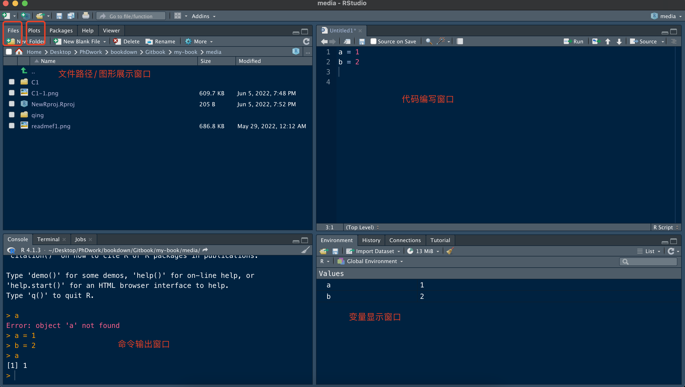
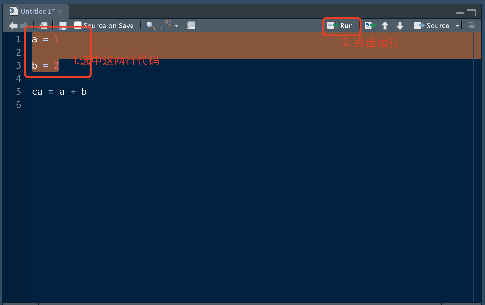
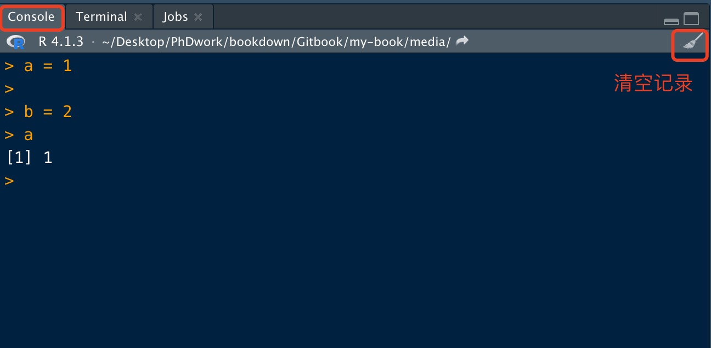

#Rstudio界面简介

## 1.R界面
我们安装好R后，就不需要操作了，这里展示Mac 系统的R界面（Windows系统如这里差不多）,可以看到当然版本为4.1.3.

打开后，关闭它，因为我们主要关注于Rstudio。

## 2.Rstudio界面
我们打开Rstudio界面。一开始是默认的白色主题，我们可以进入【Tools】->【Global Options】->【Appearance】->【Editor Theme】进行更改。选择Cobalt既可。也可以选择默认。
接下来我们介绍Rstudio界面的四个窗口，每个窗口都有特定的作用。


那么代码编辑窗口可以点击左上角的+，新建【R script】既可。


这里面四个窗口的排序，可以通过【Tools】->【Global Options】->【Panel Layout】进行选择。

### 2.1 文件路径/Plot 窗口
这个窗口可以方便我们查看Rstudio所在的文件目录及该目录下所有文件。另外还可以切换Plot，如果我们用Rstudio绘图，图片会在这里显示。其他Package/Help/viewer窗口后面用到会详细讲解。主要也是可视化的一个作用。

### 2.2 代码编辑 窗口
这个窗口我们经常会用到，因为写的代码，有时候需要反复用到，或者代码很长，这里面就可以当做临时笔记本一样，将我们的代码展示在这里并运行。

这里我们输入下列代码，选中这两行，然后点击【Run】即可（选中后也可以使用快捷键 Command + shift）。其他的按钮暂时用不到。主要是编辑code与运行。这两个主要功能。

```
a = 1
b = 2
```

### 2.3 命令运行窗口
我们刚选中的Code，运行后，就会出现在这里，这里主要是代码的一个运行与输出。我们看到了`a=1`的一个执行。但是并没有任何反应，接下来只需要键入a或者b，就可以输出a的值了。

主要是输出结果，便于我们看到运行的结果。其他的窗口不用管，目前用不到。


### 2.4 变量显示窗口
我们刚才创建的变量都会显示在这里，总而言之我们在Rstudio里面运行的每一步，这里都有记录。


#### 休息下眼睛，接下来继续我们的R基础教学。


