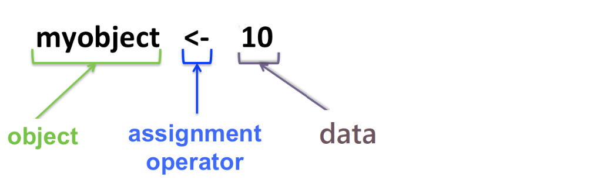

# R基础知识
我们熟悉了Rstudio界面后，接下来我们将简单介绍R的基本知识，上一章节，我们输入了

```
a = 1
```
其实是我们创建了一个数据对象，将1赋值给a。

## 1.对象（object）
在现实世界中，我们经常会使用一些物品。例如，椅子。我们可以用椅子做一些事情(坐在上面、睡在上面、或食神打唐牛)。同样，在R中，我们也需要创建一些[对象（object）](https://bookdown.org/wangminjie/R4DS/baseR-objects.html "数据科学中的 R 语言")，然后再用对这些对象进行操作。R语言数据处理实际上就是不断的创建和操控这些对象。


> 上图里面 `myobject` 是创建的变量，然后通过赋值符号`<-`，将`10`赋值给`myobject` 。为了键入方便赋值符号也可以用`=`替代。  
> 当然也可以使用快捷键 ：`alt` 和 `-`（windows系统）、`option` 和 `-`（苹果系统）

关于变量起名字的规范：见[对象操作](https://bookdown.org/wangminjie/R4DS/baseR-objects.html)

#### 对象类型

一般R里面对象分为以下几种类型。

| 对象-Object       | 描述 |
| :--------- | :--: |
| 向量-Vector   |  单个数据集合  | 
| 数据框-Dataframe   |  多个向量组成行列的表格  |   
| 列表-List   |  不同类型的向量组合  |   
| 函数-Function|  能够实现某一功能，如求和  | 

这上面记不住没关系，后续的例子操作，会慢慢介绍跟解释，只有自己操作下来，才可真正理解。

## 2.向量
我们举了`a=1`例子，这就是一个向量的对象。同样a可以赋值多个数据，如：

```
> a = 1,2
Error: unexpected ',' in "a = 1,"
> 
> a = c(1,2)
> a
[1] 1 2
```
这里需要用到 `c()` 表示一个向量，`a=c(1)`也可以，**一定要记住用`c()`括起来**。
我们观察到`c()` 构造向量的几个要求：

* 这里的c就是 combine 或 concatenate 的意思
* 它要求元素之间用英文的逗号分隔
* 且元素的数据类型是统一的，比如这里都是数值

这样，`c()`  把一组数据聚合到了一起，就构成了一个向量。

