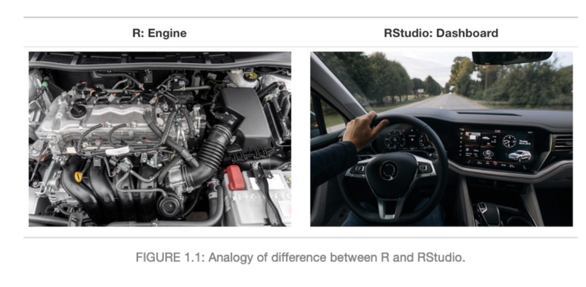

2022-06-01

---

欢迎来到《21天 极速学会R语言与数据分析》。

本书旨在帮助你学习使用R和RStudio来处理和分析你的数据。从最基本的R操作到分析自己的数据，这本书专门为没有编程基础及统计基础的小白设计。本书由浅到深，后面也会介绍及展示高级分析如机器学习模型等内容。  

希望能够帮助同学们快速掌握一门数据分析技能。

---

贡献者: jamesjin63，AnotherDayu

## 准备工作

真正开始用 R 语言之前，我们需要下载R安装包【[R官网下载](https://cran.r-project.org/)】。根据自己电脑选择安装包。

R 语言安装完成后，我们还需安装 RStudio【[RStudio官网下载](https://www.rstudio.com/)】开发环境（虽然基本的 R 控制台也能工作）。也根据自己电脑系统下载安装。

R与Rstudio的关系，就好比R是汽车发动机核心，Rstudio是装载发动机的汽车且装备一些列的配件。

> 注意：  
> 1. 安装好 R 之后，再安装 RStudio；  
> 2. Windows 系统请将软件全部安装在 C 盘的默认位置 (可以自定义更改，但是R跟Rstudio的安装必须在同一个文件目录中)，否则程序将可能无法更新或运行。

**安装视频**：[R+Rstudio程序安装](https://www.bilibili.com/video/BV15V411E74f?spm_id_from=333.999.0.0)

---

本书将从以下几个部分进行介绍

### 基础部分

1. 第一章：R基本操作
1. 第二章：数据读写
1. 第三章：数据清洗
1.   第四章：数据可视化

### 数据分析

1. 第五章：基础统计知识
1. 第六章：GLM模型
1. 第七章：GAM模型

### 番外篇
1. 第八章：gglot2绘图
2.  第九章：字符串处理
3.  第十章：地图绘制
3.  第十一章：机器学习模型

#### Contribution
If you would like to make a content contribution, please contact with us first via Github issues or by jamesjin63@163.com. We are implementing a schedule for updates and are creating a contributor guide.

>Epi-Hub Collaborators  --- National Institute of Parasitic Diseases, Chinese Center for Disease Control and Prevention; School of Global Health, Chinese Center for Tropical Diseases Research, Shanghai
